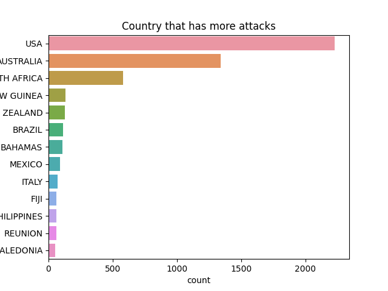
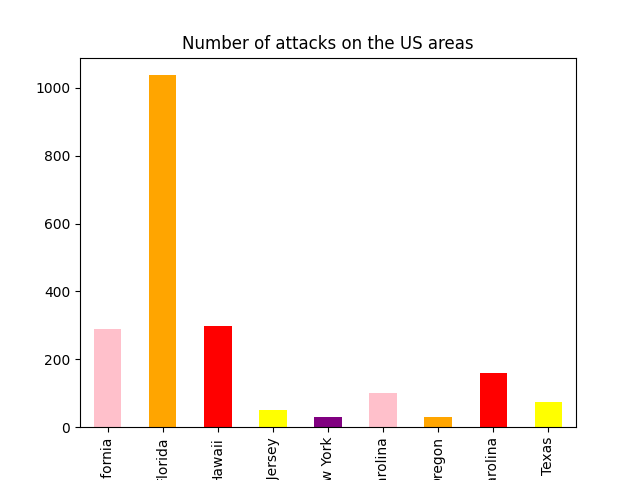
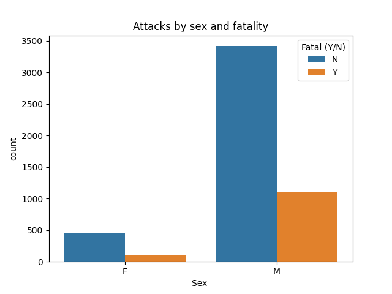
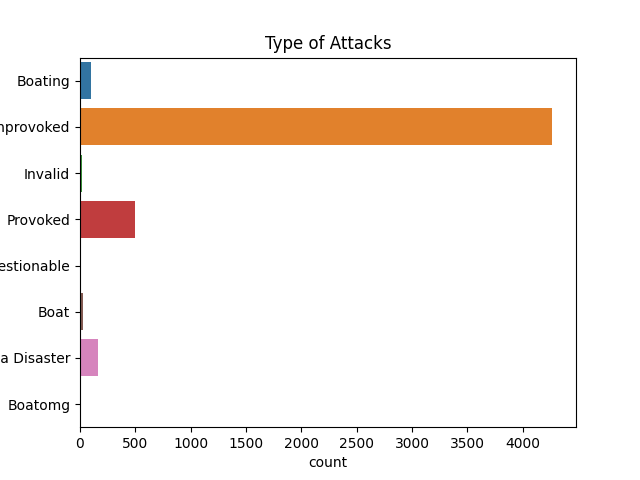
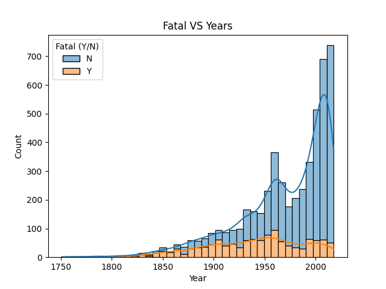

                                     PROJECT 1

**1. Problem Statement**
**1.1 Cleaning the data set**
**1.2. Analysis and conclusions**
**2. Hyphotesis 1**
**3. Hyphotesis 2**
**5. Conclusion**

In order to run this project the following libraries must be installed:

Numpy
Pandas
Seaborn
Matplotlib.pyplot

The project will be divided into 3 parts:

**1. Problem Statement**

You have a dataset containing records of shark attacks with about 2500 rows and 24 columns. ultimate goal is to analyze said data and to do this, you must first preselect the columns that you want to analyze (to work efficiently) and clean the information taking them into account.

**1.1 Cleaning the data set**
Once the columns that we will later study have been selected, we will proceed to clean the data set.
The columns to be analyzed are cleaned (case__number, date, year, fatal_(s/n), activity, species, type, sex, country, area). This step has been subdivided into 2 parts: the first corresponds to a general treatment of these data, while the second is an individual cleaning of each of them. The first process consists of deleting all those rows that lack any data(nan) in the previously mentioned columns. The second is about modifying the data, to try to group it and change its type (object) to a more consistent one for later analysis. 

**1.2. Analysis and conclusions**

**2.  Hyphotesis 1: Is the United States the country that has most attacks ? And between 2000-2010?**
   

In order to determine whether the United States actually had a greater number of attacks, a graphic representation of bars was made on the attacks that occurred between 2000-2010, but the population was also delimited, discarding the countries that had less than 20 attacks, this in order to have a clearer graph, with less information and in the same way that represents the required information. Therefore, in the graph "Countries with more than 20 attacks between 2000-2010" it can be seen that the United States was the one with the highest number of attacks (278). Therefore, in the first instance, the hypothesis is partially true.

To determine which was the area with the most attacks within the United States, a filter of the data set was carried out where only the country "United States" was taken into account and later it was grouped by Area. Said information was obtained again and filtered, excluding the areas with cases less than 20 in order to carry out the graphical representation of the data in bars. The results obtained were the 3rd area with the most attacks (35), but the main area that concentrated the highest number of attacks was Florida (151). Therefore, with these results it can be inferred that the hypothesis is not true since it does not agree with the most affected area. 

**3. Hyphotesis 2: Sharks attack more woman?Kind of attacks? Fatal VS Years?**

To determine if more women or men have died, we took the sex column.
I removed the space from the name to facilitate the handling of the column, 
the hypothesis we have created is wrong.The chart shows that males have had more deaths.
Those parameters that were neither F (Female) nor M (Male) have also been eliminated, since they were not conclusive nor did they belong in the graph.

The attacks have been determined, with the Type columns, which represents the graph.

**5. Conclusion**

This project has helped me consolidate what we have learned in class, that is, Python and its libraries.